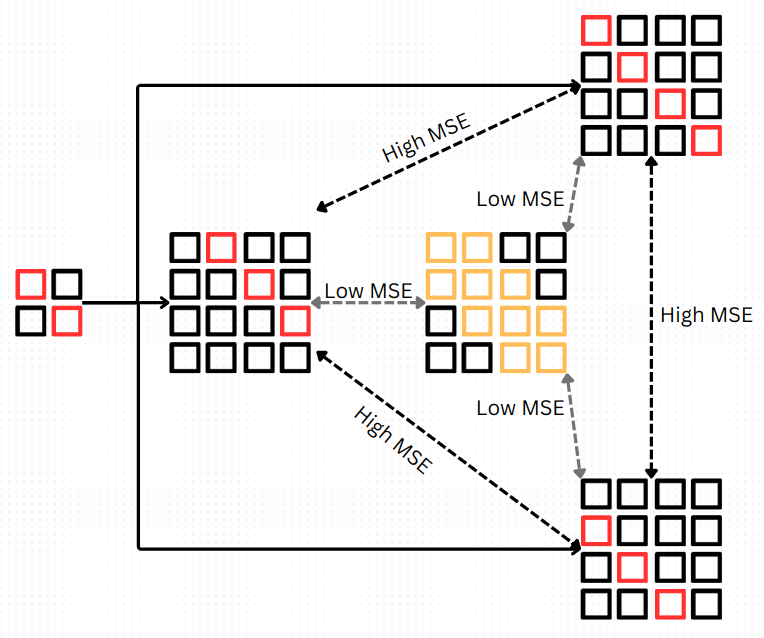

# Evaluation task for DeepLense: Superresolution for Strong Gravitational Lensing

#### March 2024

### Anirudh Shankar

## 1. Overview

This document contains a description of responses to the Common Test I. Multi-Class Classification and the Specific Test III.A and III.B: Superresolution for Strong Gravitational Lensing. 
The responses are presented as a study of super-resolution, the challenges it faces and what can be done to overcome them.
An initial description of all the models used is followed by training and evaluation procedure, and then the results and inference.

## 2. Models

This section provides a brief description of the models, as they are named in the repository. Many models are adaptations of those presented by Sagar Vinodababu [here](https://github.com/sgrvinod/a-PyTorch-Tutorial-to-Super-Resolution).
1. ResnetSISR, ResnetSISR_sparse, ResnetSISR_sparse_deep: ResNet $^{[1]}$ based **super-resolution models**. They can have different number of residual blocks that are mentioned.
2. Denoiser: Modified *ResnetSISR* model that doesn't upscale image resolution, and is instead trained to **denoise images**. It is trained against low-resolution images with added gaussian noise with different std, that are mentioned. 
3. DenoisedSISR (ResnetSISR_denoise in the repository): A **frozen** (trained but non-learning) *Denoiser* module fitted with the *ResnetSISR*, that also performs **super-resolution**. 
4. Resnet_simple: A **frozen**, truncated (to retain the first two convolutions and a maxpool) classifier that is used in my attempt at the DeepLense: [Physics-Guided Machine Learning](https://github.com/anirudhshankar99/DeepLense_PINN) evaluation task to classify strong lensing images based on dark matter substructure of the lensing object. Its purpose is to identify features it learnt in its training to produce feature space representations of the images for this task. How this helps is explained in a later section, but overall, it helps present a better loss function for learning.
5. SRGan: A GAN **super-resolution** architecture with the following modules:
    a. Generator: A trained *ResnetSISR* module
    b. Discriminator: A simpler convolution module with 6 convolution layers
    c. Feature mapper: The frozen, truncated *Resnet_simple* module

## 3. Methods and setting up

All models are trained using a 90:10 train:validation split on the training dataset, and then evaluated on mean squared error, structural similarity index and peak signal-to-noise ratio. All training and evaluation notebooks can be found in the repository. 

### 3.1 Data

#### 3.1.1 Dataset and augmentation
1. [dataset_1](https://drive.google.com/file/d/1uJmDZw649XS-r-dYs9WD-OPwF_TIroVw/view?usp=sharing) contains 1000 lensing images with no dark matter substructure, whose description is presented in $^{[2]}$. Analyses on this dataset correspond to subtask A.
2. [dataset_2](https://drive.google.com/file/d/1plYfM-jFJT7TbTMVssuCCFvLzGdxMQ4h/view?usp=sharing) contains 300 lensing images captured from the HSC and HST telescopes. As they are physically captured, they also contain a quantity of noise, and are limited in number.
All the models are trained and tested on my personal GeForce RTX 3050 (mobile) GPU. Analyses on this dataset correspond to subtask B.

#### 3.1.2 Setting up
1. Download and extract the datasets mentioned as 'dataset_1' and 'dataset_2' respectively in the main directory.
2. Use `pip install -r requirements.txt` from the parent main directory to install the required dependencies

## 4. Common task I
As presented in my attempt at the evaluation test for [Physics-Guided Machine Learning](https://github.com/anirudhshankar99/DeepLense_PINN), here are the results of common task I, using the *Resnet_simple* model, and the much deeper *ResNet18* $^{[3]}$ model.

## 5. Results

### 4.1 Subtask A
Below are results of the subtask A, on Dataset A.

| Model | MSE | SSIM | PSNR |
| --- | --- | --- | --- |
| ResnetSISR (10 residual blocks)| 0.00008 | 0.971 | 40.962 |

### 4.2 Subtask B
Below are results of the subtask B, on Dataset B.
| Model | MSE | SSIM | PSNR |
| --- | --- | --- | --- |
| ResnetSISR_sparse (10 residual blocks) | 0.0011 | 0.798 | 33.604 |
| ResnetSISR_sparse_deep (16 residual blocks) | 0.0014 | 0.747 | 32.403 |
| DenoisedSISR (with 0.1 std noise)| **0.00105** | **0.814** | **34.115** |
| DenoisedSISR (with 0.2 std noise)| 0.00117 | 0.779 | 33.056 |
| DenoisedSISR (with 0.3 std noise)| 0.00119 | 0.794 | 33.006 |
| DenoisedSISR (with 0.4 std noise)| 0.00123 | 0.774 | 32.784 |
| SRGan | 0.01387 | 0.564 | 19.259 |

## 5. Inference

Firstly, we see that increasing model depth does not improve performance.
The *DenoisedSISR* model trained with 0.1 std noise seems to be the best performing, across all statistics. The truth in this is limited. While it does outperform all other ResnetSISR architectures, and it seems to very convincingly outperform the *SRGan* too, the images have a different story to tell.
The HR Image above clearly shows two distinct point light sources, and this is not clearly reprocuced by any architecture, but the *SRGan*, which was specifically trained for this purpose, as presented in $^{[3]}$. The difference lies in the loss function that trains the architecture.

### 5.1 Limitations of training with MSE

Below is an illustration adapted from $^{[3]}$ that shows the attempts of a SR model in reconstructing a hatched pattern.

The each of the three options the model has (with red squares) are good candidates for the SR image. The model however finds it difficult to pick any of them, as the **safest** choice is the averaged choice as it gives the least MSE when compared with all other options. MSE as a loss function thus fails to capture the specific features to be magnified, and instead produces an images with blurry regions. This is well seen in Section 4.2.
The solution proposed shown in $^{[3]}$ is to use a trained truncated classifier, to select the specific features from the images. The MSE of the features of the LR image and the HR ground truth are computed and appended to the generator loss to then train the architecture. The *SRGan* is thus able to reproduce the intricate features, as seen in Section 4.2.
This is specially useful in the super-resolution of lensing images where the fine structure creates a massive difference in the inference using these images. 

## 6. Perspective

A potential upgrade could be the integration of a feature loss demonstrated above in a transformer architecture, as it would then also benefit from the transformer's capacity to study positional encodings.
An upgrade in a different approach would be the Physics-Informing of the SR architecture, as suggested HERELINKITDONTFORHET.

## 7. Bibliography

1. He, K., Zhang, X., Ren, S., & Sun, J. (2016). Deep residual learning for image recognition. In Proceedings of the IEEE conference on computer vision and pattern recognition (pp. 770-778).
2. Alexander, S., Gleyzer, S., McDonough, E., Toomey, M. W., & Usai, E. (2020). Deep learning the morphology of dark matter substructure. The Astrophysical Journal, 893(1), 15.
3. [A PyTorch Tutorial to Super-Resolution](https://github.com/sgrvinod/a-PyTorch-Tutorial-to-Super-Resolution), Sagar Vinodababu 